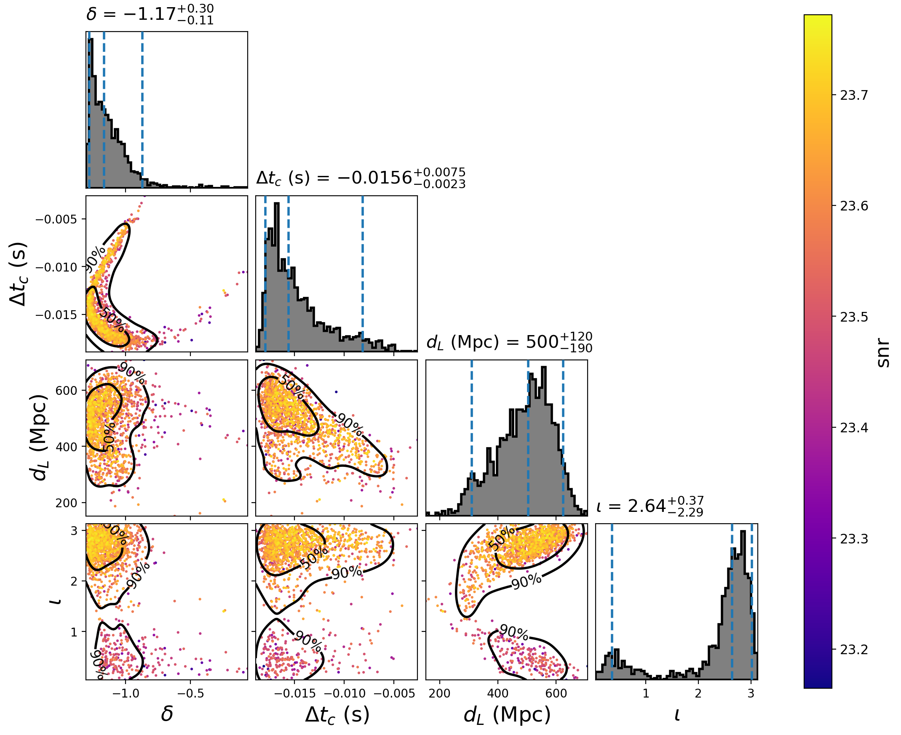

 

<h1 align="center"> 
Here you can find a summary on some of my research projects.
 </h1>

I mostly do theory, data analysis, and machine learning in cosmology. Still, I would love to dig into actual observations whenever it happens.
Most of the questions that keep me awake at night circle around finding the best cosmological model and theory of gravity.

My research interests include many specific questions, from the evolution and formation of the supermassive black holes to the nature of dark matter and dark energy, large-scale structure formation, and tracing the seed for the structures in the early universe.

Here you will find some of my open-source projects. I will update this list over time. Click on the Images to re-direct to the Git repositories of each of the projects (If they have a public one)!

# Deep Learning large Scale Structure Formation

Can we use complex deep learning mappings to gain physical insight into the super non-linear process of dark matter halo collapse? What will it tell us about the role of the initial condition of the universe in the number density of the halos in the current universe? In this work, we tried to answer these questions.  
### Find the pre-print of this research [here](https://arxiv.org/abs/2112.14743).

# Constraining temperature fluctuations in the Inter-Galactic Medium (IGM)

When did the Helium in the IGM become Ionized? How long did it last for the universe to reach equilibrium again after this re-ionization phase? What was the distribution of the HeII ionizing sources? Did they all turn on at the same time? We tried capsulated all these crucial questions about the IGM and the quasars (the most probable sources of HeII ionization) into one single question and tried to answer it. How did the temperature of the universe affected by this ionization process? Can we even observe the imprints of ionization on the IGM's temperature? 
Results ar ready and will become publicly available soon.

# How fast is the Universe expanding (measurement of H0 value) ?!

It sounds insane, but this is actually a long-known important question for astronomers and cosmologists. Not only for itself but because it is a question from the fundamental laws of physics! Traditionally there have been two important measurements by the best cosmologists in the world to find the answer. Still, these measurements are in huge disagreement with each other (huge in terms of statistics!)! Something should be really wrong about at least one of them! How can we find which of these measurements is the correct one? A new independent way to measure this expansion rate is needed! 
I'm trying to answer the question of the Universe's expansion rate using the new window opened for us till LIGO by gravitational waves. It's not a new method. For instance, one can find more about the measurement of H0 value via novel methods using gravitational waves by the LIGO/Virgo collaboration [here](https://arxiv.org/pdf/2111.03604.pdf).
What is new is how different assumptions about our universe (different cosmological models) can affect these methods? How robust these measurements with gravitational waves are? It's yet to be found! 
I'll tell more about my results when I know them!!

# Primoridoal Black Holes!
YES! I love them! But have not done anything original! Yet! So I will just guide to a few of my most favourite review articles about "Primordial Black Holes as a candidate for Dark Matter".

* ["Primordial Black Holes as Dark Matter: Recent Developments" by Bernard Carr and Florian Kuhnel](https://arxiv.org/abs/2006.02838)
* ["Primordial black holes—perspectives in gravitational wave astronomy" by Misao Sasaki et al.](https://inspirehep.net/literature/1648436)
* ["Primordial Black Holes: from Theory to Gravitational Wave Observations", G. Franciolini's PhD thesis](https://arxiv.org/abs/2110.06815) (I wish it was my PhD thesis!)

*"Primordial Black Holes are dark, but their future is bright."* :)

